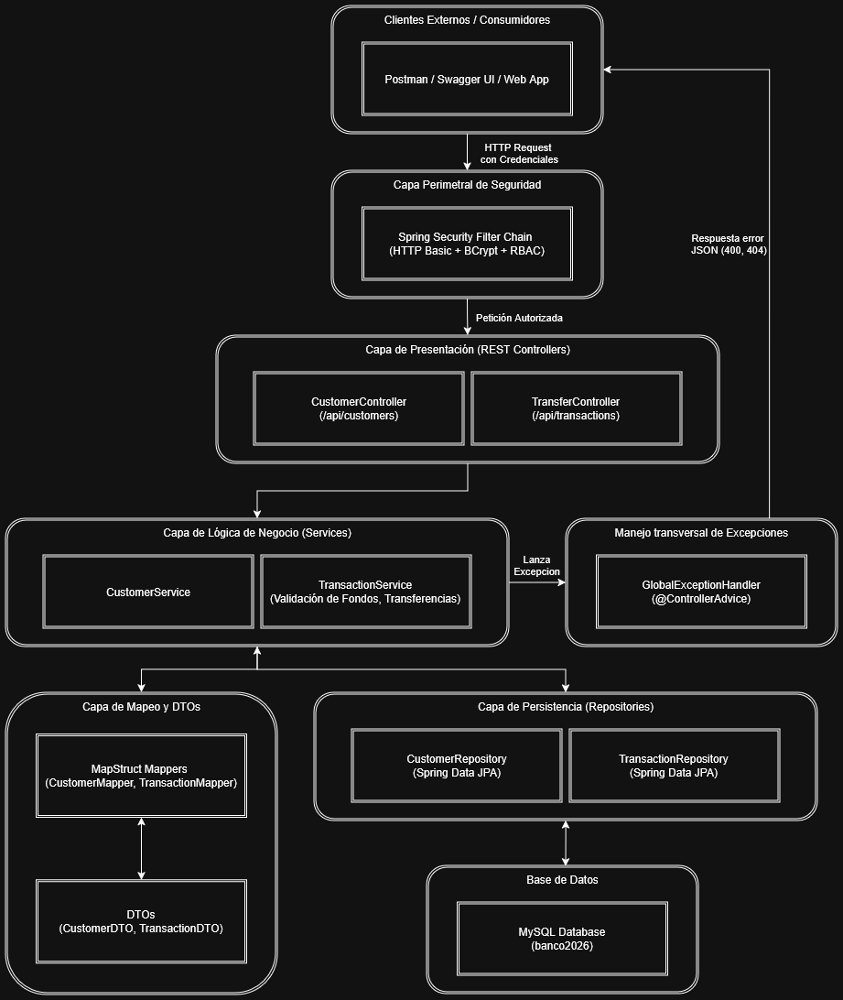

# Laboratorio 01: Implementación de una Arquitectura en Capas para un Sistema Bancario RESTful


**Estudiante:** Mateo Vargas Tirado  
**Asignatura:** Arquitectura de Software  
**Institución:** Universidad de Antioquia (UdeA)  
**Semestre:** 2026-2  
**Repositorio Backend (API REST):** [https://github.com/AraiGumaDev/back-lab01-banco2026-arqsoft-udea](https://github.com/AraiGumaDev/back-lab01-banco2026-arqsoft-udea)  
**Repositorio Frontend (Cliente Web):** [https://github.com/AraiGumaDev/front-lab01-banco2026-arqsoft-udea](https://github.com/AraiGumaDev/front-lab01-banco2026-arqsoft-udea)

---

## 1. Introducción

En el desarrollo de software empresarial contemporáneo, el diseño y la adopción de patrones arquitectónicos sólidos representan la base para construir sistemas escalables, mantenibles y tolerantes a fallos. Los sistemas del dominio bancario y financiero demandan un nivel riguroso de consistencia transaccional, desacoplamiento entre componentes, control de acceso perimetral y trazabilidad en sus operaciones.

El presente informe técnico documenta el diseño, la estructuración y la implementación de un servicio backend RESTful denominado **Banco 2026**. A través de la adopción de una **Arquitectura en Capas (Layered Architecture)** sobre el ecosistema de Spring Boot y Java 17, se construyó una solución que gestiona de manera integral el ciclo de vida de clientes, cuentas bancarias y transferencias monetarias, garantizando la separación de responsabilidades mediante la integración de DTOs, mapeadores automáticos, persistencia relacional con ORM, manejo centralizado de excepciones y políticas de autorización basadas en roles (RBAC).

---

## 2. Objetivos

### 2.1. Objetivo General
Diseñar e implementar un servicio backend RESTful para un sistema bancario que aplique los principios de la arquitectura en capas, asegurando la integridad de las transacciones monetarias, la seguridad de los endpoints y una documentación interactiva y estandarizada.

### 2.2. Objetivos Específicos
* **Modelar y persistir el dominio:** Implementar entidades relacionales (`Customer`, `Transaction`) mediante Spring Data JPA y MySQL, asegurando la integridad referencial y el correcto almacenamiento de estados y balances.
* **Aplicar desacoplamiento de capas:** Utilizar el patrón Data Transfer Object (DTO) asistido por MapStruct y Project Lombok para aislar el modelo de base de datos de las interfaces de comunicación externa.
* **Garantizar la lógica de negocio y transaccionalidad:** Desarrollar servicios que validen saldos, verifiquen la existencia de cuentas remitente/destinatario y ejecuten operaciones atómicas de débito y crédito.
* **Centralizar el manejo de errores:** Crear una estructura unificada de control de excepciones (`@ControllerAdvice`) que transforme fallos de negocio y de validación en respuestas HTTP semánticamente correctas.
* **Incorporar seguridad y control de acceso:** Configurar autenticación HTTP Basic y autorización basada en roles (`ROLE_USER` y `ROLE_ADMIN`) mediante Spring Security.
* **Documentar el contrato de interfaz:** Proveer una documentación viva e interactiva de la API haciendo uso de la especificación OpenAPI 3 y Swagger UI.

---

## 3. Herramientas de Software Empleadas

El desarrollo del proyecto se sustentó en un conjunto de tecnologías y bibliotecas de estándar en la industria:

| Categoría | Herramienta / Tecnología | Versión     | Descripción y Justificación |
|---|---|-------------|---|
| **Lenguaje** | Java OpenJDK | 17 (LTS)    | Plataforma de ejecución principal con soporte para características modernas de tipado y rendimiento. |
| **Framework Base** | Spring Boot | 4.1.1       | Marco de desarrollo para la agilización de microservicios y aplicaciones empresariales basadas en Spring. |
| **Persistencia / ORM** | Spring Data JPA / Hibernate | 3.x         | Abstracción para el mapeo objeto-relacional y operaciones CRUD mediante repositorios de interfaz. |
| **Base de Datos** | MySQL Server | 8.0         | Sistema gestor de base de datos relacional (RDBMS) para almacenar clientes y transacciones. |
| **Seguridad** | Spring Security | 6.x         | Módulo para la gestión de filtros de seguridad, encriptación BCrypt y control de acceso RBAC. |
| **Mapeo de Objetos** | MapStruct | 1.5.5.Final | Generador de código en tiempo de compilación para la conversión eficiente y sin sobrecosto entre Entidades y DTOs. |
| **Productividad** | Project Lombok | 1.18.30     | Generación automática de código repetitivo (getters, setters, constructores, constructores Builder). |
| **Documentación** | SpringDoc OpenAPI Starter | 2.8.5       | Integración con OpenAPI 3 y Swagger UI para exploración y prueba interactiva de endpoints. |
| **Gestión de Construcción** | Apache Maven / Maven Wrapper | 3.9+        | Automatización del ciclo de vida de compilación, resolución de dependencias y empaquetado del artefacto. |
| **Control de Versiones** | Git & GitHub | —           | Control de versiones distribuido para el registro incremental de características y colaboración. |

---

## 4. Arquitectura Propuesta

### 4.1. Descripción General
Se seleccionó una **Arquitectura en Capas (N-Tier / Layered Architecture)** organizada en un esquema DTO-Controller-Service-Repository-Entity. Cada capa cuenta con una única responsabilidad bien delimitada:

1. **Capa de Configuración y Seguridad (`config`):**
   * `SecurityConfig`: Define la cadena de filtros (`SecurityFilterChain`), la política de sesión sin estado (`STATELESS`), el encriptador de contraseñas `BCryptPasswordEncoder` y los usuarios en memoria (`user` y `admin`).
   * `OpenApiConfig`: Personaliza la documentación Swagger agregando soporte para el esquema de autenticación `basicAuth`.
2. **Capa de Exposición / Controladores REST (`controller`):**
   * `CustomerController` y `TransferController`: Atienden las peticiones HTTP entrantes, delegan el procesamiento a la capa de servicios y retornan respuestas con códigos de estado HTTP semánticos (`200 OK`, `201 CREATED`, `204 NO CONTENT`).
3. **Capa de Transferencia de Datos y Mapeo (`DTO`, `mapper`):**
   * `CustomerDTO`, `TransactionDTO`, `TransferRequestDTO`: Encapsulan la información que viaja entre el cliente y el servidor.
   * `CustomerMapper`, `TransactionMapper`: Interfaces procesadas por MapStruct para convertir limpiamente entre entidades de dominio y DTOs.
4. **Capa de Lógica de Negocio (`service`):**
   * `CustomerService` y `TransactionService`: Contienen las reglas bancarias (verificación de cuentas existentes, validación de saldos suficientes para débitos, consistencia y reversión lógica en actualizaciones/eliminaciones de transacciones).
5. **Capa de Persistencia (`repository`):**
   * `CustomerRepository` y `TransactionRepository`: Extienden de `JpaRepository` para proporcionar operaciones CRUD y consultas derivadas (`findByAccountNumber`, `findBySenderAccountNumberOrReceiverAccountNumber`).
6. **Capa de Dominio / Entidades (`entity`):**
   * `Customer` y `Transaction`: Clases anotadas con JPA que mapean directamente las tablas relacionales de la base de datos MySQL.
7. **Capa Transversal de Manejo de Excepciones (`exception`):**
   * `GlobalExceptionHandler`: Intercepta excepciones de tipo `ResourceNotFoundException` e `IllegalArgumentException`, retornando respuestas estructuradas en formato JSON con estados `404 Not Found` y `400 Bad Request`.

### 4.2. Diagrama de Arquitectura y Flujo de Información



---

## 5. Procedimiento de Desarrollo e Historial de Git

El proyecto fue construido de forma iterativa e incremental. A continuación, se detalla el procedimiento de desarrollo:


### Paso 1: Inicialización del Proyecto y Configuración Base (`a3c2f3f` y `a0b1d7a`)
* Creación de la estructura del proyecto Maven con Spring Boot Starter Web, JPA y MySQL Connector.
* Configuración del procesador de anotaciones en el `pom.xml` integrando **Lombok**, **MapStruct** y el puente `lombok-mapstruct-binding` para permitir la interoperabilidad de compilación.
* Definición inicial del archivo `application.properties` con parámetros de conexión a MySQL y configuración del dialecto Hibernate.

### Paso 2: Modelado de Entidades, Repositorios y Mappers (`a0b1d7a`)
* Creación de las entidades JPA `Customer` (atributos: `id`, `firstName`, `lastName`, `accountNumber`, `balance`) y `Transaction` (atributos: `id`, `senderAccountNumber`, `receiverAccountNumber`, `amount`, `timestamp`).
* Definición de interfaces `CustomerRepository` y `TransactionRepository` extendiendo de `JpaRepository`.
* Creación de los mappers `CustomerMapper` y `TransactionMapper` mediante anotaciones de MapStruct (`@Mapper(componentModel = "spring")`).

### Paso 3: Implementación del Core Transaccional y Operaciones de Transferencia (`a0b1d7a` y `b4710aa`)
* Desarrollo del método `transferMoney` en `TransactionService`:
  * Validación de parámetros de entrada (números de cuenta y montos no nulos).
  * Consulta y validación de existencia de cuentas de origen y destino.
  * Verificación de fondos disponibles en la cuenta origen.
  * Débito en la cuenta origen, crédito en la cuenta destino y registro de la transacción con *timestamp* actual.
* Implementación de consultas adicionales (`getAlltransactions`, `getTransactionById`, `getTransactionsForAccount`).
* Implementación de lógica de ajuste y reversión en `updateTransactionById` y `deleteTransactionById` para recalcular saldos cuando una transacción es modificada o anulada.

### Paso 4: Manejo Centralizado de Excepciones (`4005136`)
* Creación de la excepción de tiempo de ejecución `ResourceNotFoundException`.
* Implementación de `GlobalExceptionHandler` anotado con `@ControllerAdvice` y `@ExceptionHandler`, garantizando que:
  * Excepciones de recurso no encontrado respondan con código `404 Not Found`.
  * Errores de validación de negocio (`IllegalArgumentException`) respondan con código `400 Bad Request`.

### Paso 5: Documentación con Swagger / OpenAPI y Variables de Entorno (`e9a746b`)
* Adición de la dependencia `springdoc-openapi-starter-webmvc-ui`.
* Creación de `OpenApiConfig` configurando metadatos de la API y soporte para el esquema de seguridad HTTP Basic.
* Refactorización de `application.properties` para extraer credenciales de base de datos a variables de entorno con valores por defecto (`${APP_DB_USER:banco_user}`, `${APP_DB_PASSWORD:user123}`).

### Paso 6: Configuración de Seguridad y Control de Acceso (`b4b9654`)
* Implementación de `SecurityConfig` configurando `SecurityFilterChain` con política `STATELESS` y desactivación de CSRF para API REST.
* Creación de dos usuarios en memoria mediante `InMemoryUserDetailsManager` con contraseñas codificadas en `BCrypt`:
  * `user` (Rol: `ROLE_USER`)
  * `admin` (Rol: `ROLE_ADMIN`)
* Definición de reglas de autorización perimetral:
  * Swagger y OpenAPI públicos (`/swagger-ui/**`, `/v3/api-docs/**`).
  * Consultas de lectura (`GET /api/**`) disponibles para roles `USER` y `ADMIN`.
  * Operaciones de modificación y eliminación (`POST`, `PUT`, `DELETE /api/**`) exclusivas para el rol `ADMIN`.

### Paso 7: Completitud de Servicios de Clientes y Refactorización Final (`ba56c4d` y `03e5de1`)
* Implementación de métodos de actualización (`updateCustomer`) y borrado (`deleteCustomer`) en `CustomerService` y `CustomerController`.
* Verificación integral de flujos de prueba y consolidación de la documentación del proyecto.

---

## 6. Seguridad y Políticas de Acceso (RBAC)

El sistema implementa **HTTP Basic Authentication** con control de acceso basado en roles:

| Rol | Usuario por Defecto | Contraseña por Defecto | Alcance de Permisos |
|---|---|---|---|
| **`ROLE_USER`** | `user` | `root` (configurable vía `USER_PASSWORD`) | Solo lectura. Permite ejecutar solicitudes `GET` sobre `/api/customers/**` y `/api/transactions/**`. |
| **`ROLE_ADMIN`** | `admin` | `root` (configurable vía `ADMIN_PASSWORD`) | Acceso total. Permite operaciones de lectura (`GET`), creación (`POST`), edición (`PUT`) y borrado (`DELETE`). |

> **Nota:** La documentación Swagger UI y la especificación OpenAPI (`/swagger-ui/**`, `/v3/api-docs/**`) son de libre acceso sin requerir cabecera de autorización.

---

## 7. Contrato de la API REST

### 7.1. Módulo de Clientes (`/api/customers`)

| Método | Endpoint | Rol Requerido | Descripción | Parámetros / Cuerpo | Respuesta Exitosa |
|---|---|---|---|---|---|
| `GET` | `/api/customers` | `USER` / `ADMIN` | Obtener listado de todos los clientes | Ninguno | `200 OK` + `List<CustomerDTO>` |
| `GET` | `/api/customers/{id}` | `USER` / `ADMIN` | Consultar cliente específico por ID | `id` (Path variable) | `200 OK` + `CustomerDTO` |
| `POST` | `/api/customers` | `ADMIN` | Registrar un nuevo cliente | `CustomerDTO` (JSON) | `201 CREATED` + `CustomerDTO` |
| `PUT` | `/api/customers/{id}` | `ADMIN` | Actualizar los datos de un cliente | `id` + `CustomerDTO` (JSON) | `200 OK` + `CustomerDTO` |
| `DELETE` | `/api/customers/{id}` | `ADMIN` | Eliminar cliente del sistema | `id` (Path variable) | `204 NO CONTENT` |

### 7.2. Módulo de Transacciones (`/api/transactions`)

| Método | Endpoint | Rol Requerido | Descripción | Parámetros / Cuerpo | Respuesta Exitosa |
|---|---|---|---|---|---|
| `GET` | `/api/transactions` | `USER` / `ADMIN` | Listar el histórico general de transferencias | Ninguno | `200 OK` + `List<TransactionDTO>` |
| `GET` | `/api/transactions/{id}` | `USER` / `ADMIN` | Consultar el detalle de una transacción | `id` (Path variable) | `200 OK` + `TransactionDTO` |
| `POST` | `/api/transactions` | `ADMIN` | Ejecutar transferencia entre cuentas | `TransactionDTO` (JSON) | `201 CREATED` + `TransactionDTO` |
| `PUT` | `/api/transactions/{id}` | `ADMIN` | Modificar monto de una transacción | `id` + `TransactionDTO` (JSON) | `200 OK` + `TransactionDTO` |
| `DELETE` | `/api/transactions/{id}` | `ADMIN` | Anular/Eliminar transacción con ajuste | `id` (Path variable) | `204 NO CONTENT` |

---

## 8. Guía de Puesta en Marcha y Ejecución

### 8.1. Requisitos Previos
* **Java Development Kit (JDK):** Versión 17 o superior instalada y configurada en el `PATH`.
* **MySQL Server:** Instancia activa en `localhost:3306`.
* **Base de datos:** Crear el esquema `banco2026`:
  ```sql
  CREATE DATABASE banco2026;
  ```

### 8.2. Configuración de Variables de Entorno (Opcional)
Se pueden definir las siguientes variables en el sistema o en el entorno de ejecución:
```bash
APP_DB_USER=banco_user
APP_DB_PASSWORD=user123
USER_PASSWORD=root
ADMIN_PASSWORD=root
```

### 8.3. Compilación y Ejecución
1. **Compilar y empaquetar el proyecto:**
   ```bash
   ./mvnw clean compile
   ```
2. **Iniciar el servidor de aplicaciones Spring Boot:**
   ```bash
   ./mvnw spring-boot:run
   ```
3. **Acceder a la interfaz de Swagger UI:**
   Abrir en el navegador web: [http://localhost:8080/swagger-ui.html](http://localhost:8080/swagger-ui.html)  
   Para probar endpoints autenticados en Swagger, hacer clic en **Authorize** e ingresar las credenciales de `user` o `admin`.

---

## 9. Conclusiones

1. **Efectividad del Patrón en Capas:** La separación explícita de responsabilidades en capas (Controlador, Servicio, Repositorio y Dominio) permitió encapsular la lógica de negocio bancaria de manera ordenada, facilitando el mantenimiento y permitiendo futuras ampliaciones sin generar acoplamiento directo entre el almacenamiento y la exposición HTTP.
2. **Seguridad e Integridad de Datos mediante DTOs:** El uso de DTOs complementado con MapStruct evitó la sobreexposición involuntaria de las entidades JPA, optimizó el tráfico de red y previno vulnerabilidades como la asignación masiva de campos no deseados.
3. **Control Transaccional en Dominio Financiero:** La validación estricta de saldo previo a la transferencia y la sincronización de estados entre cuentas remitente y destinatario resultan indispensables para garantizar la consistencia en sistemas bancarios.
4. **Seguridad Declarativa y Control de Acceso:** La implementación de Spring Security con políticas de control basadas en roles (RBAC) demostró ser un mecanismo eficiente y desacoplado para asegurar que operaciones destructivas o críticas (escritura, edición y borrado) queden estrictamente reservadas para usuarios administrativos.
5. **Valor de la Documentación Viva:** La inclusión de OpenAPI / Swagger UI reduce significativamente la fricción de integración entre equipos de frontend y backend, ofreciendo un contrato claro y una herramienta de prueba inmediata.

---

## 10. Bibliografía

1. **Fowler, M.** (2002). *Patterns of Enterprise Application Architecture*. Addison-Wesley Professional.
2. **Walls, C.** (2022). *Spring in Action* (6th ed.). Manning Publications.
3. **VMware Tanzu / Spring Team.** (2026). *Spring Boot Reference Documentation*. Recuperado de [https://docs.spring.io/spring-boot/docs/current/reference/html/](https://docs.spring.io/spring-boot/docs/current/reference/html/)
4. **VMware Tanzu / Spring Security Team.** (2026). *Spring Security Reference*. Recuperado de [https://docs.spring.io/spring-security/reference/](https://docs.spring.io/spring-security/reference/)
5. **SmartBear Software.** (2026). *OpenAPI Specification 3.0.0*. Recuperado de [https://swagger.io/specification/](https://swagger.io/specification/)
6. **MapStruct Authors.** (2026). *MapStruct 1.5 Reference Guide*. Recuperado de [https://mapstruct.org/documentation/reference-guide/](https://mapstruct.org/documentation/reference-guide/)

---

## 11. Proyectos Anexos en GitHub

El código fuente completo, los historiales de cambios y las versiones ejecutables de los componentes del presente laboratorio se encuentran disponibles en los siguientes repositorios de GitHub:

### 11.1. Repositorio Backend (API REST)
* 🔗 **Enlace:** [https://github.com/AraiGumaDev/back-lab01-banco2026-arqsoft-udea](https://github.com/AraiGumaDev/back-lab01-banco2026-arqsoft-udea)
* 📥 **Comando de clonación:**
  ```bash
  git clone https://github.com/AraiGumaDev/back-lab01-banco2026-arqsoft-udea.git
  ```

### 11.2. Repositorio Frontend (Cliente Web)
* 🔗 **Enlace:** [https://github.com/AraiGumaDev/front-lab01-banco2026-arqsoft-udea](https://github.com/AraiGumaDev/front-lab01-banco2026-arqsoft-udea)
* 📥 **Comando de clonación:**
  ```bash
  git clone https://github.com/AraiGumaDev/front-lab01-banco2026-arqsoft-udea.git
  ```
